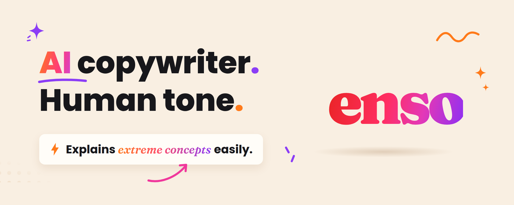

# AI Copywriter

by [Mickey Haslavsky](https://github.com/mikiarlo3)

A portable agent skill that does the two halves of the copy job most tools split apart: it writes copy that earns attention (clickbait titles, short descriptions, microcopy, subject lines), and it strips out every sign of AI-generated writing so the result reads like a person wrote it. It is plain Markdown, so it runs in any harness that supports skill-style instructions.

It is built on [blader's Humanizer](https://github.com/blader/humanizer), which packaged Wikipedia's "Signs of AI writing" guide into 33 detectable, fixable patterns. Those 33 patterns are all still here, unchanged. What this skill adds is the other direction: not just cleaning up prose after the fact, but writing headlines, product blurbs, and button labels that convert without tripping a single one of those patterns.

The copywriting method comes from [enso.bot/research](https://enso.bot/research), where the enso team studies how to communicate through marketing in the best possible way. The short version of what that research keeps finding: copy works when it starts from the feeling of the person on the other end and explains the concept in the simplest possible words. This skill is that finding, made operational.

## How it thinks

A really good copywriter is not thinking about the product. They are thinking about the person on the other end. That is the core of the communication research at [enso.bot/research](https://enso.bot/research), and it is how this skill works: before writing a single word, it answers two questions.

**What is that person feeling at the exact moment the line reaches them?** Not the demographic, the person in the moment. A headline reaches someone mid-scroll, half a second from gone. An error message reaches someone whose task just broke and who might be blaming themselves. An empty state reaches someone new who is quietly worried they're doing it wrong. A subject line reaches someone deleting on reflex. The feeling decides the tone, the length, and what comes first: a frustrated person needs the fix in the first three words; a skeptical person needs proof before adjectives. If the skill doesn't know the feeling, it asks you who the reader is and what just happened to them.

**What is the simplest way to explain this?** If the product can't be described in the words you'd use across a kitchen table, it isn't understood well enough to sell yet, and the skill will keep asking what it actually does until it can. Simple means short, common words, one thought per sentence, and nothing the reader has to look up or reread. The reader never does any work. The writer does all of it.

To get those answers, the skill interviews before it writes. It asks for three things up front (in one batch, skipping whatever you already told it): the ICP (who exactly this is for, down to what they'd type into a search box at 11pm), the category (the mental shelf the reader files you on, which decides who you're compared against), and the story (the real moment behind the copy, with real numbers). Then it pressure-tests the story before drafting: is there a surprising number, a moment it almost failed, a belief that turned out wrong, something you'd tell at dinner unprompted? If not, it keeps digging with you until a true story that's also interesting shows up, because writing from a weak story produces generic copy no craft can save.

And it doesn't stop at filled-in fields. If what it knows about the ICP wouldn't surprise a colleague, if it can't tell what's table stakes in your category versus what would raise an eyebrow, if it can't write the reader's 11pm search query word for word, it comes back with follow-ups ("What do they complain about, in the words they'd use?", "What claim would nobody else in the category dare to make?") instead of writing around the gap. Answers that are present but generic get questioned just as proactively as answers that are missing.

Every variant it produces is an answer to those two questions, and when it recommends one, the reason is the reader's feeling, never "this one is punchier."

## Why both jobs in one skill

Ask a model for a headline and you get "Unlock the Ultimate Guide to Revolutionize Your Workflow." Ask it to tone that down and you get something so flat nobody clicks it. The two failure modes come from the same place: the model is thinking about the product and its adjectives, not about the reader and their half-second of attention.

Copy that works is specific. "We cut our AWS bill by $40,000 in one afternoon" gets the click because the promise is concrete and checkable. "Game-changing cloud savings" gets scrolled past because the reader's filter deleted it before it registered. The humanizer rules aren't a constraint on the copywriting; they're most of what makes it good.

The skill also refuses to invent product facts. If the strongest headline needs a number, the number has to come from you. It will ask rather than make one up.

## Installation

### Skills CLI

Install globally with the cross-agent skills CLI so the skill is available in every project:

```bash
npx skills add mikiarlo3/ai-copywriter --global
```

Update an existing install:

```bash
npx skills update ai-copywriter --global
```

To install globally into every supported agent harness:

```bash
npx skills add mikiarlo3/ai-copywriter --global --agent '*'
```

Omit `--global` for a project-local install that can be committed and shared with collaborators. Start a new agent session or reload skills after installation.

### Claude Code plugin

Claude Code users can also install it as a plugin:

```
/plugin marketplace add mikiarlo3/ai-copywriter
/plugin install ai-copywriter@ai-copywriter
```

The skill is then invoked as `/ai-copywriter:ai-copywriter`.

### Manual

Any agent harness can use the skill directly because the runtime artifact is `SKILL.md`. Install it wherever your harness expects skill directories:

```bash
git clone https://github.com/mikiarlo3/ai-copywriter.git /path/to/your/skills/ai-copywriter
```

## Using it with ChatGPT, Manus, and other AI tools

The whole skill is one Markdown file with no code or dependencies, so any LLM that accepts text can run it. The pattern is always the same: get the contents of [`SKILL.md`](SKILL.md) in front of the model, tell it to follow them, then make your requests.

**Claude (claude.ai and the Claude apps).** Claude Code users should use the plugin or skills CLI install above. On claude.ai, create a Project, upload `SKILL.md` to its knowledge, and put one line in the project instructions: "Follow SKILL.md for all copywriting and humanizing requests." For a single conversation, attach the file to your first message with that same line.

**ChatGPT.** Create a custom GPT and paste the full contents of `SKILL.md` into its Instructions field; every chat with that GPT now runs the skill. For a one-off conversation, paste the contents as your first message and add: "Follow these instructions for the rest of this conversation."

**Manus.** Manus supports the skill format natively, so don't paste the file; install it. Go to Settings, then Skills, then "+ Add", and either import from GitHub by pasting this repository's URL, or download the repo as a ZIP (the "Code" button on GitHub, then "Download ZIP") and upload that. Once installed, invoke it with `/ai-copywriter` in chat. If the GitHub import errors, use the ZIP upload; it works regardless of how the repository's branches are configured.

**Any other LLM.** Put `SKILL.md` in the system prompt if you control it, or in the first message if you don't. The file is small enough (about 8,000 tokens) to fit comfortably in any modern model's context.

## Usage

### Writing copy

Ask for what you need and give it the raw material (the product, the audience, the facts). Titles come back as 5 to 10 variants across different angles, with a pick:

```
/ai-copywriter

Write titles for this blog post: [paste draft or summary]
```

```
Write the empty state, error message, and button copy for an invoicing
app's client list screen.
```

```
Meta description for this landing page, 155 characters:
[paste page copy]
```

```
Write a LinkedIn post from this: [what happened, in your own words,
with the real numbers and the real moment]
```

### Writing a strategic blog post

For founder-facing thesis pieces (the "old playbook is breaking, here is the new one" genre), the skill follows a dedicated template: [references/strategic-blog-template.md](references/strategic-blog-template.md). Ask for a strategic or category-defining blog post and give it whatever raw material you have:

```
/ai-copywriter

Write a strategic blog post.

Topic: why traditional outbound is dying and what AI-native companies do instead
Target reader: seed-stage B2B founders doing their own go-to-market
Old playbook: high-volume cold email sequences
Emerging shift: growth through community and product-led distribution
Examples: [companies you have watched do this, and what exactly they did]
Evidence: [numbers, founder conversations, experiments you can vouch for]
```

Topic and target reader are enough to start; the skill interviews you for the rest. Here is what happens between your prompt and the finished post:

1. **Intake.** The skill runs its standard interview (ICP, category, story) aimed at this format: who exactly the reader is, what shelf the post sits on, and, most important, the observed pattern. The story test is strict here. If you have not actually watched companies do the new thing, there is no post yet, and the skill keeps digging instead of writing a trend piece from nothing.
2. **Framework construction.** It organizes the material per the template: an opening built on the broken playbook and the contradiction (some companies are growing anyway), a two-to-four-phase history that makes the thesis feel inevitable, a two-to-five-word name for the new model, one or two ground rules, and four to seven numbered strategies where every company example explains a mechanism and every section ends with an operating lesson.
3. **Copywriting pass.** The headline goes through the clickbait rules (variants across angles, banned-word list, pick justified by the reader's feeling), and the intro is written for a reader who is skeptical of trend pieces and worried their playbook is decaying.
4. **Humanizer audit.** The whole post runs the draft, audit, final loop against all 33 patterns before you see it. Strategic essays are where significance inflation, AI vocabulary, and aphorism formulas concentrate, so this pass is not optional and the template says so.

The no-fabrication rule holds throughout: the skill will not invent company results, quotes, community sizes, or market numbers to make the thesis look stronger. Evidence comes from you or from a named source, and uncertain causation gets cautious language.

You get back a headline (with variants and a pick), a one-sentence subtitle, and a 1,500-to-2,500-word post: intro, phases, named model, ground rules, numbered strategies, and a compressed final formula.

### Humanizing text

Paste text and it comes back with the AI tells removed:

```
/ai-copywriter

Please humanize this text: [your text]
```

Point it at a file and it rewrites the prose in place:

```
Humanize the prose in docs/launch-post.md
```

### Voice calibration

To match your personal writing style, provide a sample of your own writing:

```
/ai-copywriter

Here's a sample of my writing for voice matching:
[paste 2-3 paragraphs of your own writing]

Now humanize this text:
[paste AI text to humanize]
```

The skill analyzes your sentence rhythm, word choices, and quirks, then applies them to the rewrite instead of producing generic "clean" output.

## What the copywriting mode covers

Each format is the two questions applied to a different moment in the reader's day:

**Clickbait titles and headlines.** The reader is mid-scroll, bored, owes you nothing. So: specific promises, honest curiosity gaps, the reader's vocabulary instead of the industry's. Banned on sight: ultimate, game-changer, unlock, elevate, revolutionize, "you won't believe." You get variants across angles (number, question, contradiction, outcome, named enemy, how-to), not one take.

**Short descriptions.** The reader is comparing you to three open tabs, hopeful but burned before. So: the first five words carry the benefit, one idea per description, and character budgets are respected by cutting ideas, not by compressing sentences into fragments.

**Microcopy.** The reader is inside your product, mid-task. Buttons name the result ("Send invoice," never "Submit"). Errors reach someone whose task just broke, so they say what went wrong and how to fix it, in that order, without blame. Empty states reach someone new and unsure, so they sell the one next action. Destructive confirmations state the consequence.

**Subject lines and hooks.** The reader is clearing an inbox, deleting on reflex. So: written to one person, payoff in the first 30 to 40 characters, no fake urgency and no fake familiarity.

**LinkedIn posts.** The reader is scrolling between meetings, hoping for something that feels like work but reads like gossip. So: the first two lines (all that shows before "...see more") open mid-story with the most concrete detail available, one true story or stance per post, one portable claim the reader can repeat in their own words, a recognizable professional audience, and an ending that recruits substantive comments instead of begging "Thoughts?". LinkedIn's short-paragraph rhythm is honored as the format's convention, but the story must be yours and true: the skill asks for the real moment and the real numbers, and it will not invent a firing, a candidate, or a "DM I got this morning." You get 3 to 5 hook options plus one full post built on the best one. The rules follow the sharing research collected in [references/linkedin-virality.md](references/linkedin-virality.md) (Berger and Milkman on high-arousal sharing, LinkedIn's own relevance and dwell-time engineering posts, and cascade research on why virality is noisy), and the skill deliberately avoids algorithm folklore: no golden hour, no link-penalty myths, no engagement pods.

**Strategic blog posts.** The reader is a founder who suspects the playbook they are running is quietly decaying, and who has been burned by enough trend pieces to distrust big claims without mechanisms. So: open with the broken playbook and the contradiction, organize the history into named phases, give the new model a name that can spread, and deliver numbered strategies where every example explains what the company actually did. The full format lives in [references/strategic-blog-template.md](references/strategic-blog-template.md), and the finished post still clears all 33 patterns.

## The humanizer engine

Based on [Wikipedia's "Signs of AI writing"](https://en.wikipedia.org/wiki/Wikipedia:Signs_of_AI_writing) guide, maintained by WikiProject AI Cleanup, via [blader/humanizer](https://github.com/blader/humanizer). Every rewrite runs a draft, then an "obviously AI generated" audit pass, then a second rewrite to catch lingering AI-isms.

Rewrites follow a no-fabrication rule: they never add facts, names, dates, or citations that aren't in the source text. Specificity has to come from the source or the author, not from the rewrite.

### 33 patterns detected

#### Content patterns

| # | Pattern | Before | After |
|---|---------|--------|-------|
| 1 | **Significance inflation** | "marking a pivotal moment in the evolution of..." | "was established in 1989 as part of a wider decentralization" |
| 2 | **Notability name-dropping** | "cited in NYT, BBC, FT, and The Hindu" | Trim the list; keep only sourced context |
| 3 | **Superficial -ing analyses** | "symbolizing... reflecting... showcasing..." | Remove, or keep only what the source supports |
| 4 | **Promotional language** | "nestled within the breathtaking region" | "is a town in the Gonder region" |
| 5 | **Vague attributions** | "Experts believe it plays a crucial role" | Name a real source or cut the claim |
| 6 | **Formulaic challenges** | "Despite challenges... continues to thrive" | Keep the sourced facts; cut the boosterism |

#### Language patterns

| # | Pattern | Before | After |
|---|---------|--------|-------|
| 7 | **AI vocabulary** | "Actually... additionally... testament... landscape... showcasing" | "also... remain common" |
| 8 | **Copula avoidance** | "serves as... features... boasts" | "is... has" |
| 9 | **Negative parallelisms / tailing negations** | "It's not just X, it's Y", "..., no guessing" | State the point directly |
| 10 | **Rule of three** | "innovation, inspiration, and insights" | Use natural number of items |
| 11 | **Synonym cycling** | "protagonist... main character... central figure... hero" | "protagonist" (repeat when clearest) |
| 12 | **False ranges** | "from the Big Bang to dark matter" | List topics directly |
| 13 | **Passive voice / subjectless fragments** | "No configuration file needed" | Name the actor when it helps clarity |

#### Style patterns

| # | Pattern | Before | After |
|---|---------|--------|-------|
| 14 | **Em/en dashes** | "institutions—not the people—yet this continues—" | Cut them: periods, commas, colons, or parentheses |
| 15 | **Boldface overuse** | "**OKRs**, **KPIs**, **BMC**" | "OKRs, KPIs, BMC" |
| 16 | **Inline-header lists** | "**Performance:** Performance improved" | Convert to prose |
| 17 | **Title Case Headings** | "Strategic Negotiations And Partnerships" | "Strategic negotiations and partnerships" |
| 18 | **Emojis** | "🚀 Launch Phase: 💡 Key Insight:" | Remove emojis |
| 19 | **Curly quotes** | `said “the project”` | `said "the project"` |
| 26 | **Hyphenated word pairs** | “cross-functional, data-driven, client-facing” | Drop hyphens on common word pairs |
| 27 | **Persuasive authority tropes** | "At its core, what matters is..." | State the point directly |
| 28 | **Signposting announcements** | "Let's dive in", "Here's what you need to know" | Start with the content |
| 29 | **Fragmented headers** | "## Performance" + "Speed matters." | Let the heading do the work |
| 30 | **Diff-anchored writing** | "This function was added to replace..." | Describe what it does, not what changed |
| 31 | **Manufactured punchlines / staccato drama** | "It had no preference. No prior. No nostalgia." | Use varied sentence lengths and concrete claims |
| 32 | **Aphorism formulas** | "Symmetry is the language of trust" | Replace the formula with the actual claim |
| 33 | **Conversational rhetorical openers** | "Honestly? It depends..." | Remove the fake-candid setup |

#### Communication patterns

| # | Pattern | Before | After |
|---|---------|--------|-------|
| 20 | **Chatbot artifacts** | "I hope this helps! Let me know if..." | Remove entirely |
| 21 | **Cutoff disclaimers** | "While details are limited in available sources..." | Find sources or remove |
| 22 | **Sycophantic tone** | "Great question! You're absolutely right!" | Respond directly |

#### Filler and hedging

| # | Pattern | Before | After |
|---|---------|--------|-------|
| 23 | **Filler phrases** | "In order to", "Due to the fact that" | "To", "Because" |
| 24 | **Excessive hedging** | "could potentially possibly" | "may" |
| 25 | **Generic conclusions** | "The future looks bright" | Specific plans or facts |

## Example: same product, both modes

Say you hand it a note-taking app for lawyers and ask for launch copy.

**What a raw model produces:**

> 🚀 Introducing CaseNotes: The Ultimate Game-Changing Solution for Legal Professionals! Unlock unprecedented productivity, elevate your practice, and revolutionize the way you capture, organize, and leverage your case notes — all in one seamless, intuitive platform.

**What this skill produces:**

> Reader: a lawyer at 7pm who just spent twenty minutes hunting through legal pads for one line from a deposition. Feeling: that specific frustration, plus fatigue from every app that promised to fix it. Simplest explanation of the product: you type notes, and later you can find any line by searching.
>
> Headline options:
> 1. "Your case notes, searchable before you're back at your desk"
> 2. "Stop losing billable hours to notes you can't find"
> 3. "The note app that knows what a deposition is"
>
> Pick: #2. She's not dreaming about better software, she's mad about tonight's wasted twenty minutes, and #2 names that exact frustration in her own units (billable hours).
>
> Meta description (148 chars): "CaseNotes turns your hearing and deposition notes into a searchable case file. Find any quote, date, or exhibit in seconds, from any device."
>
> Empty state: "Add your first case to start taking notes." (A new user doesn't need selling here; they need to know the one next step.)

The second version sells harder than the first. It just doesn't sound like a press release fed through a blender, and every choice traces back to how the reader feels in that moment.

## References

- [enso.bot/research](https://enso.bot/research), the communication research behind the reader-first copywriting method
- [references/linkedin-virality.md](references/linkedin-virality.md), the evidence-based guide behind the LinkedIn rules, with citations to the underlying sharing research
- [Wikipedia: Signs of AI writing](https://en.wikipedia.org/wiki/Wikipedia:Signs_of_AI_writing), the source of the pattern list
- [WikiProject AI Cleanup](https://en.wikipedia.org/wiki/Wikipedia:WikiProject_AI_Cleanup), the maintaining organization
- [blader/humanizer](https://github.com/blader/humanizer), the upstream skill this one extends (MIT)

## Version history

- **1.6.0** - Added strategic blog posts to the copywriting mode, backed by a full template (references/strategic-blog-template.md): category-defining, founder-oriented posts that open with a broken playbook, explain the market's evolution in named phases, name the emerging model, and deliver four to seven numbered strategies with mechanisms and operating lessons. The template runs on the skill's existing machinery: the intake supplies the reader, category, and observed pattern, the reader-first questions shape the headline and introduction, the no-fabrication rule governs all evidence, and the finished post passes the full 33-pattern humanizer audit. No change to the 33 patterns.
- **1.5.1** - Portability fix for stricter skill importers (reported against Manus): flattened the frontmatter description from a multi-line YAML block scalar to a single-line quoted string, and replaced the README's paste-based Manus instructions with the native install path (Settings, Skills, + Add, GitHub import or ZIP upload). No change to behavior or the 33 patterns.
- **1.5.0** - The intake now probes quality, not just presence: after collecting the ICP, category, and story, the skill tests its own understanding (could it surprise a colleague about this ICP, does it know table stakes versus eyebrow-raising claims in the category, can it write the reader's 11pm search query verbatim) and proactively asks follow-up questions the moment its material stops being interesting, instead of writing around a gap it noticed. No change to the 33 patterns.
- **1.4.0** - Added a mandatory intake before writing: the skill asks for the ICP, the category, and the story in one batch (skipping what the brief already covers), plus a story development loop with four interest tests (surprising number, near-failure moment, overturned belief, dinner-table test) and digging questions to help the author find a true story worth telling before any drafting starts. Embedded mode writes from what exists and names what was missing. Grounded the LinkedIn section in sharing research (shipped as references/linkedin-virality.md): one portable claim per post, high-arousal but professionally credible energy, a recognizable audience, hooks that accurately preview the payoff, comment prompts with intellectual content, and an explicit ban on algorithm folklore and engagement pods. Raised the SKILL.md portability budget to 600 lines. No change to the 33 patterns.
- **1.3.0** - Added LinkedIn posts to the copywriting mode: hook-first structure (the two lines before "...see more" carry the post), one true story or stance per post, endings that recruit real comments, and delivery as 3 to 5 hook options plus a full post. LinkedIn's short-paragraph rhythm is allowed as a scoped format exception to pattern 31, and the no-fabrication rule is explicit: stories, dialogue, and numbers must come from the author. Raised the SKILL.md portability budget from 500 to 550 lines to fit the section. No change to the 33 patterns.
- **1.2.0** - Added "Copy that recruits its next reader" to the copywriting mode: repeatable lines over clever ones, share-worthy specifics that give the reader social cover, every product surface treated as an acquisition surface, invite loops written into the copy where the product allows it, and a rule that share-me moments must be true. No change to the 33 patterns.
- **1.1.1** - Attributed the reader-first copywriting method to [enso.bot/research](https://enso.bot/research) in the README and the skill's reference section. No change to behavior or the 33 patterns.
- **1.1.0** - Made reader-first thinking the foundation of the copywriting mode: two mandatory pre-writing questions (name the feeling of the person on the other end at the moment the line reaches them; find the simplest kitchen-table way to explain the concept), a per-format map of reader feelings (headline, description, error, empty state, subject line), pick rationales justified by the reader's feeling instead of craft, and copy-specific audit questions (does the line meet the feeling; can the reader repeat the promise after one read; does it survive alone on a billboard). Examples updated to show the reasoning. No change to the 33 patterns.
- **1.0.0** - First release of AI Copywriter. Forked from blader/humanizer v2.9.1 (all 33 patterns retained unchanged) and added COPYWRITING MODE: clickbait titles and headlines, short descriptions, microcopy, and subject lines, plus a copy-request invocation mode that delivers variants with a pick, a no-fabrication rule for product facts, and a billboard-test audit question for copy.

## License

MIT. Original humanizer copyright Siqi Chen; copywriting additions copyright Mickey Haslavsky.
